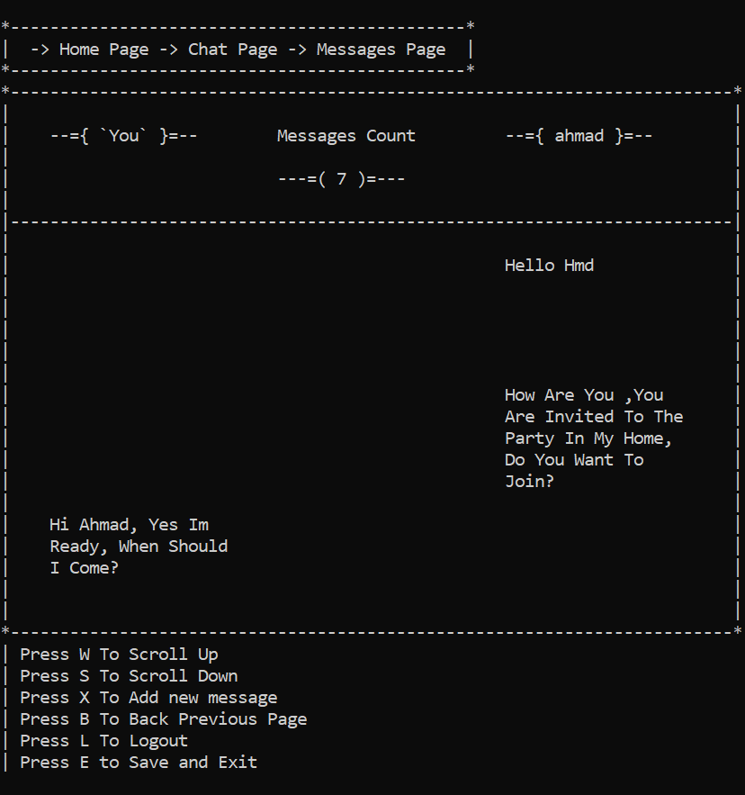

# SocialApp - Console Based Social Network (C#)

A simple console-based social media application built with C#.  
This project simulates the core features of a social networking platform such as authentication, posts, friends, and chat using a clean and organized architecture.

---

## 📌 Project Description

SocialApp is a console application that allows users to:
- Register and log in
- Create and view posts
- Send and accept friend requests
- View friend lists
- Chat with friends

The project follows a structured design using:
- **Services** for business logic
- **Pages** for UI representation
- **Controllers** for navigation, input handling, and rendering  
It also uses a centralized **AppState** and **DataManager** for managing application state and persistent data.

---

## 🚀 Features

- ✅ User Registration & Login
- ✅ Profile Page
- ✅ Create & View Posts
- ✅ Friend System (Send / Accept Requests)
- ✅ Friends List
- ✅ Real-Time Chat Simulation
- ✅ Console-Based Navigation System
- ✅ Data Persistence via DataManager

---

## 🛠️ Technologies Used

- Language: **C#**
- Platform: **.NET Console Application**
- Architecture Pattern:
  - Controllers
  - Services
  - Pages (View Layer)
- Data Handling: In-memory + Persistent Storage using JSON files via `DataManager`

---

## 🧩 Project Structure
SocialApp/
│
├── Controllers/
│ ├── NavigationController
│ ├── InputController
│ ├── RendererController
│ └── PageConttroller
│
├── Services/
│ ├── AuthenticationServices
│ ├── UserServices
│ ├── PostServices
│ ├── FriendServices
│ └── MessageServices
│
├── Pages/
│ ├── AuthenticatePage
│ ├── HomePage
│ ├── ProfilePage
│ ├── PostsPage
│ ├── MyPostsPage
│ ├── NewPostsPage
│ ├── FriendsPage
│ ├── MyFriendsPage
│ ├── FriendRequestsPage
│ ├── SendFriendRequestPage
│ └── ChatPage
│
├── Scripts/
├── AppState.cs
├── DataManager.cs
└── Program.cs
